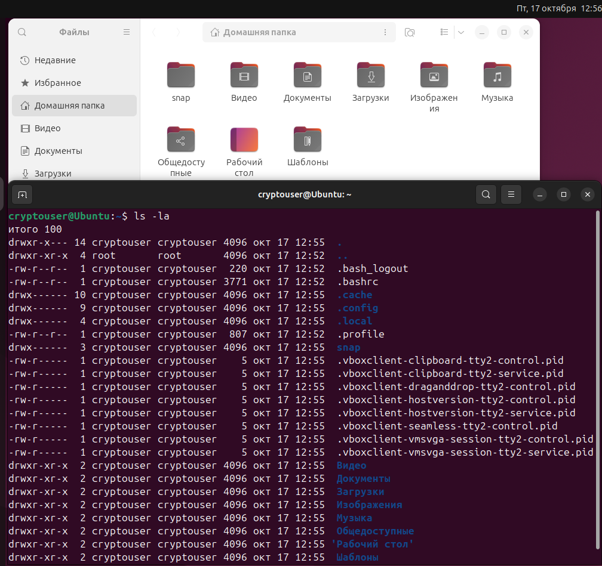
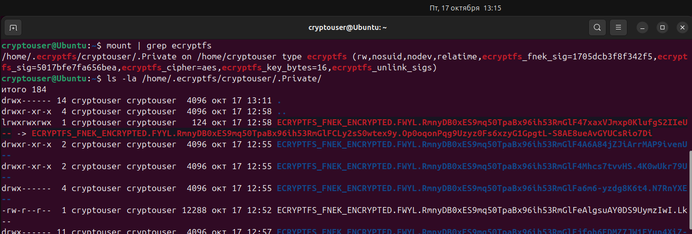
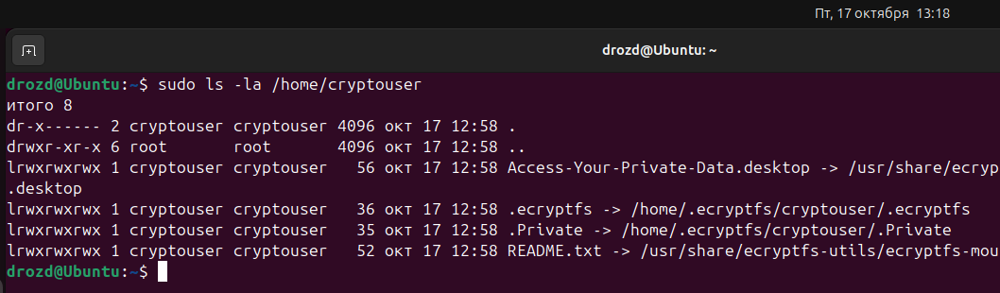
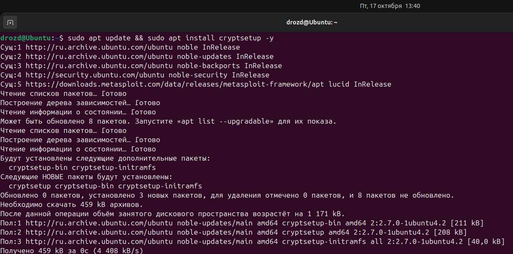
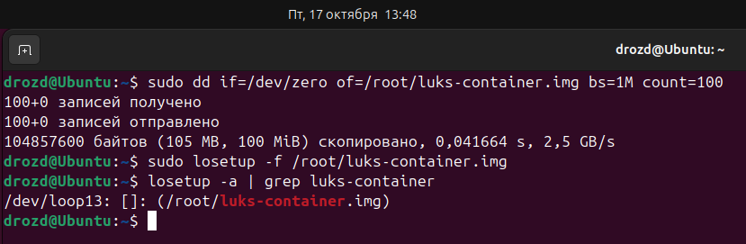
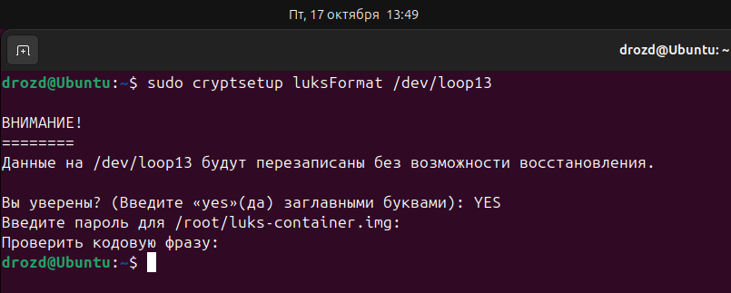
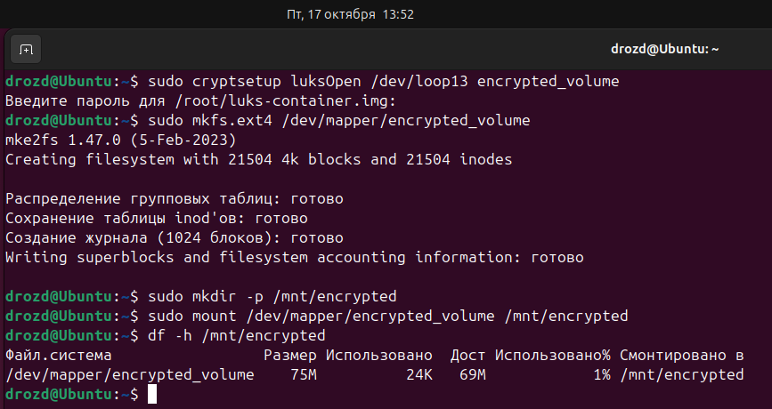
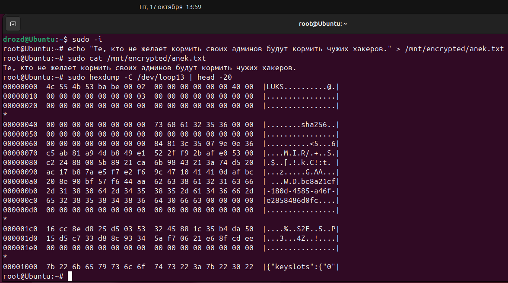

# Домашнее задание к занятию "`Защита хостаы`" - `Гривняшкин Р. В.`

---

### Задание 1  

`Директория нового пользователя.`  
  

`Шифрование каталога.`
  
  
---

### Задание 2  
`Установка LUKS.`  
  

`Создание раздела.`  
  
  

`Шифрование`
  
  

